# Mermaid Flow

발표 자료와 README 문서에 붙여넣기 좋은 Mermaid 다이어그램 모음입니다.

## [전체] 유저 플로우

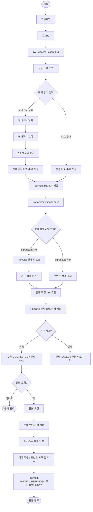

## [전체] 시퀀스 다이어그램

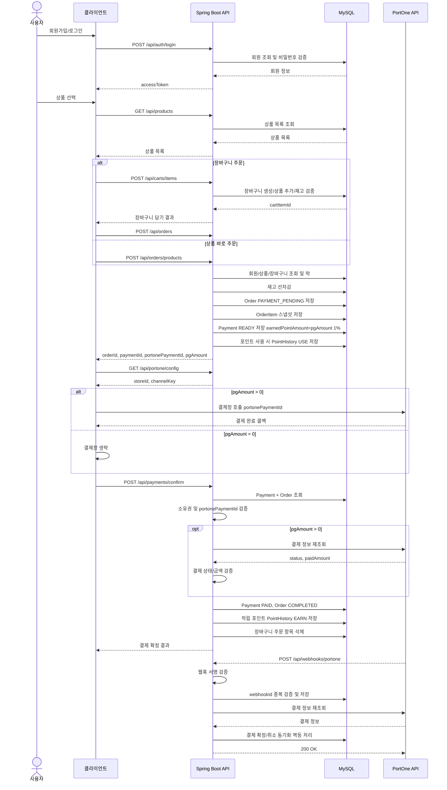

## [장바구니] 장바구니 담기 및 재고 수정 흐름

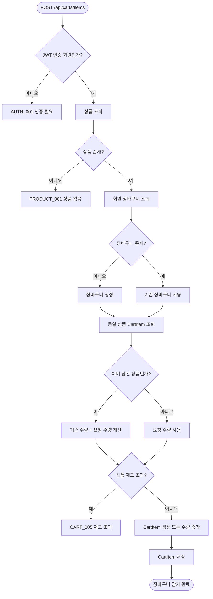

## [주문] 주문서 미리보기 흐름

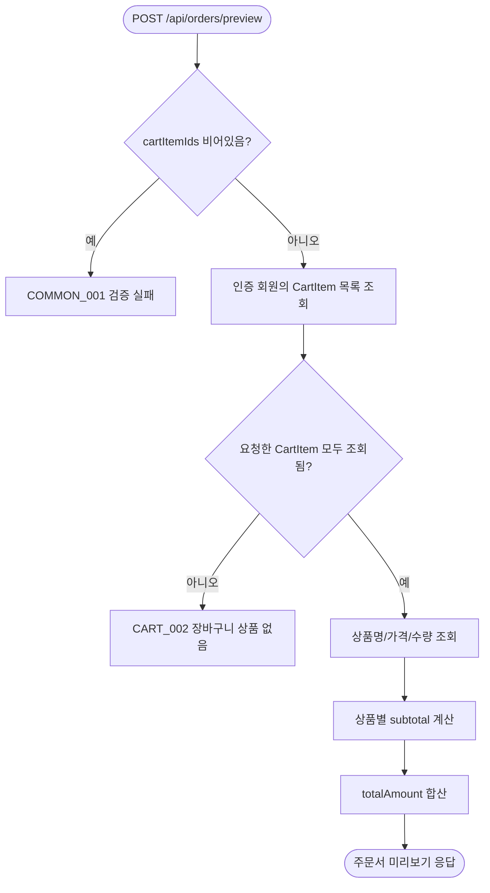

## [주문] 상품 주문 및 상품 선차감

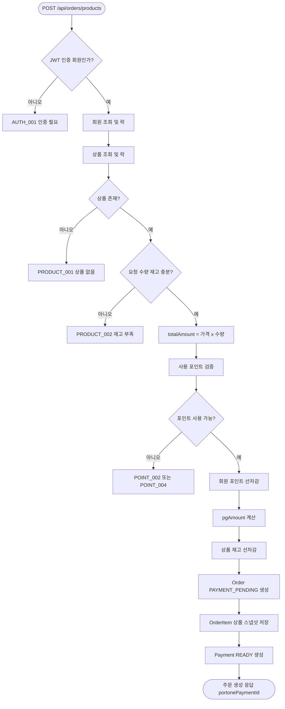

## [주문] 주문 취소 및 상품 선차감 복구

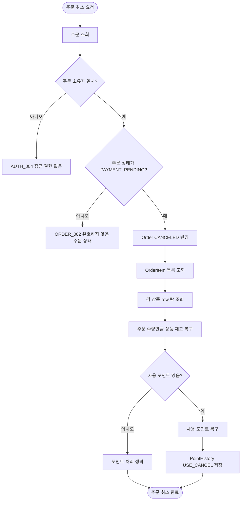

> 현재 코드에는 주문 취소 Controller가 없습니다. 위 흐름은 `Order.cancel()` 도메인 규칙과 주문 생성 시 재고 선차감 정책을 기준으로 한 구현 예정/설계 플로우입니다.

## [인증] JWT 인증 흐름

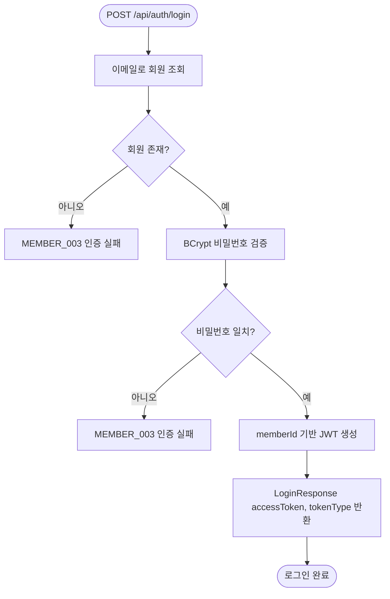

## [인증] 인증이 필요한 API 흐름

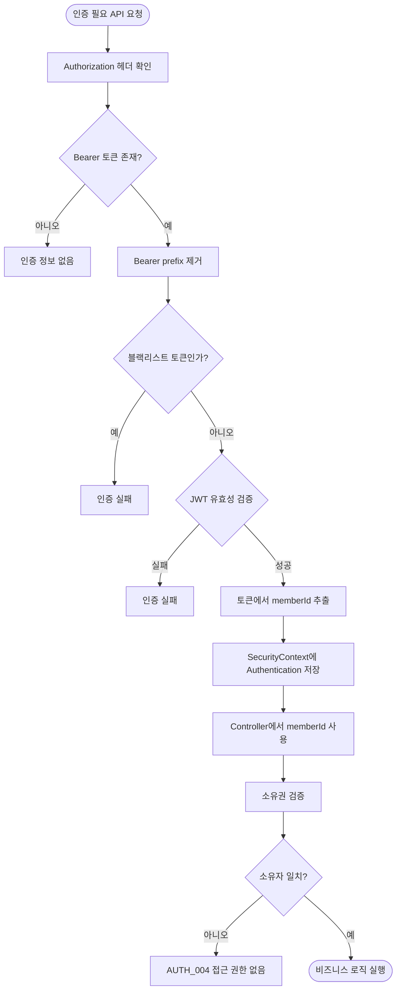

## [결제] 일반 카드 결제 확정 흐름

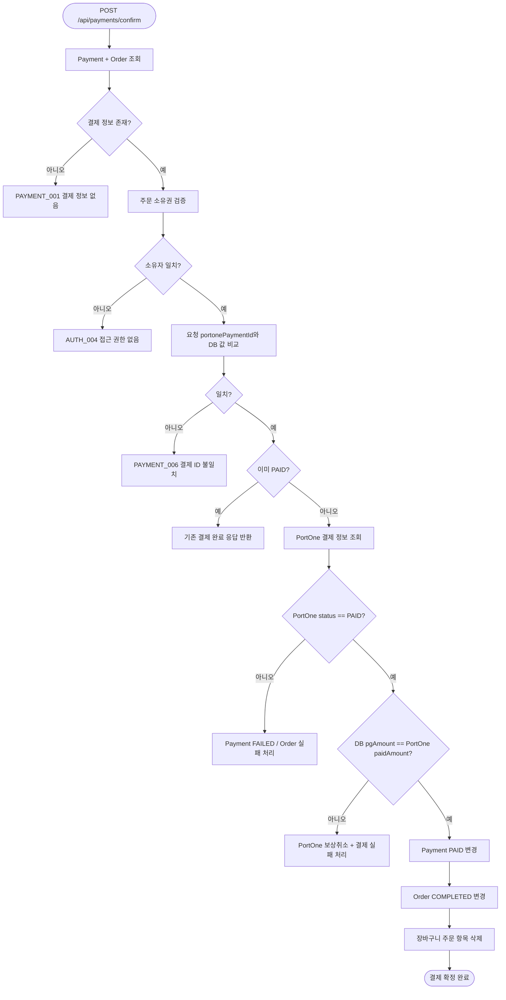

## [결제] 포인트 + 카드 복합 결제 흐름

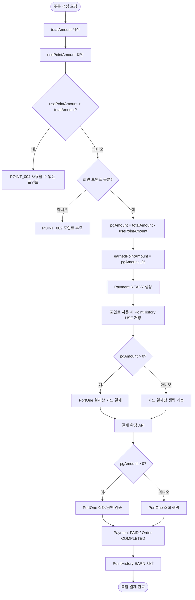

## [결제] 웹훅 멱등 동기화 흐름

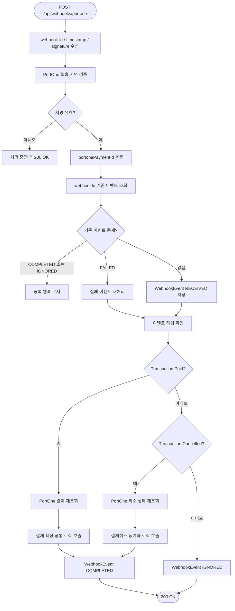

## [환불] 부분 환불 흐름

```mermaid
flowchart TD
    A([POST /api/payments/{paymentId}/refunds]) --> B[Payment row 락 조회]
    B --> C[결제 소유권 검증]
    C --> D{소유자 일치?}
    D -->|아니오| D1[AUTH_004 접근 권한 없음]
    D -->|예| E{Payment 상태 PAID 또는 PARTIAL_REFUNDED?}
    E -->|아니오| E1[REFUND_002 환불 불가 상태]
    E -->|예| F[중복 orderItemId 검증]
    F --> G[OrderItem 조회 및 주문 소속 검증]
    G --> H[기존 REQUESTED/COMPLETED 환불 수량 합산]
    H --> I{잔여 환불 수량 초과?}
    I -->|예| I1[REFUND_003 수량 초과]
    I -->|아니오| J[스냅샷 가격 x 수량으로 환불 금액 계산]
    J --> K[포인트 환불액 / PG 환불액 계산]
    K --> L[Refund REQUESTED 저장]
    L --> M[RefundItem 저장]
    M --> N{pgRefundAmount > 0?}
    N -->|예| O[PortOne 환불 요청]
    N -->|아니오| P[PortOne 호출 생략]
    O --> Q{PortOne 환불 성공?}
    Q -->|실패| Q1[Refund FAILED 처리]
    Q -->|성공| R[Refund COMPLETED 처리]
    P --> R
    R --> S[환불 수량만큼 재고 복구]
    S --> T[사용 포인트 복구]
    T --> U[적립 포인트 회수]
    U --> V[Payment PARTIAL_REFUNDED 또는 REFUNDED]
    V --> W{전액 환불?}
    W -->|예| X[Order CANCELED]
    W -->|아니오| Y[주문 상태 유지]
    X --> Z([환불 완료])
    Y --> Z
```

## [상품] 상품 주문 흐름

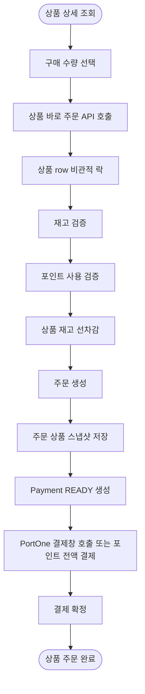

## [포인트] 포인트 잔액 ↔ 원장 동기화 흐름

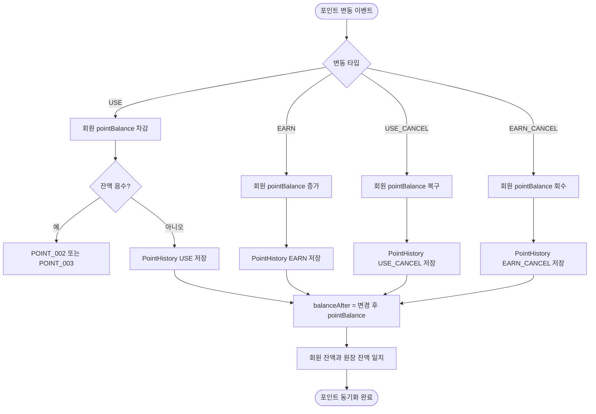
